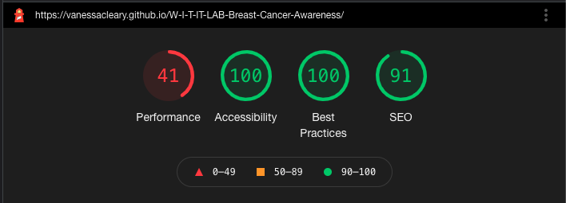
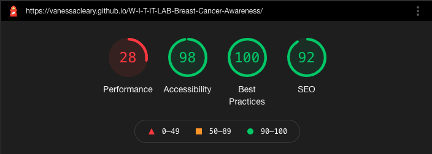

# Bust IT: Cancer Without Borders

## Team Name: Chat 'til Late

---

[Here is a link to the final project](https://vanessacleary.github.io/W-I-T-IT-LAB-Breast-Cancer-Awareness)

BASIC DESCRIPTION OF PROJECT

It is designed to be responsive on a wide range of devices, whilst also being easy to navigate through.

WHY DID WE CHOOSE THIS PROJECT

Transgender people are often overlooked and under-represented as a group, especially when it comes to information and resources available relating to breast cancer.

## Contents

* [User Experience (UX)](#user-experience-(ux))
  * [Initial Discussion](#initial-discussion)
  * [User Stories](#user-stories)

* [Design](#design)
  * [Color Scheme](#color-scheme)
  * [Typography](#typography)
  * [Imagery](#imagery)
  * [Wireframes](#wireframes)
  * [Features](#features)
  * [Audio](#audio)

* [Technologies Used](#technologies-used)
  * [Languages Used](#languages-used)
  * [Frameworks, Libraries & Programs Used](#frameworks-libraries-and-programs-used)

* [Deployment](#deployment)
  * [Initial Deployment](#initial-deployment)
  * [How to Fork it](#how-to-fork-it)
  * [How to Clone it](#how-to-clone-it)
  * [Making a Local Clone](#making-a-local-clone)

* [Testing](#testing)
  * [W3C Validator](#w3c-validator)
  * [Testing User Stories](#testing-user-stories)
  * [Further Testing](#further-testing)
  * [Solved Bugs](#solved-bugs)
  * [Known Bugs](#known-bugs)
  * [Lighthouse](#lighthouse)
    * [Performance](#performance)
    * [Accessibility](#accessibility)
    * [Best Practices](#best-practices)
    * [SEO](#seo)

* [Credits](#credits)
  * [Code](#code)
  * [Content](#content)
  * [Media](#media)
  * [Acknowledgements](#acknowledgements)

---

## User Experience (UX)

### Initial Discussion

WHAT WE WANTED FROM THIS PROJECT

### User Stories

* As a generic user, I want to be made aware of Breast Cancer in under-represented Genders

#### Client Goals

* WHAT THE CLIENT WANTS, NOT THE USER

#### First Time Visitor Goals

* WHAT A FIRST TIME VISITOR WANTS, LIKE EASY TO UNDERSTAND, EASY TO NAVIGATE

#### Returning Visitor Goals

* LIKE REPLAYABILITY, WHY THEY WANT TO RETURN TO THE SITE, EXTRA FEATURES

#### Frequent Visitor Goals

* WHY SOMEONE WOULD COME BACK REPEATEDLY, AND WHAT THEY'D WANT, LIKE EASY TO BOOK SOMETHING, OR A SCOREBOARD, ETC.

[Back to Top](#title)

---

## Design

### Color Scheme

* We chose to use the colours that are in the transgender flag as our site is primarily designed for the transgender community.

### Typography

We have used the google fonts [Nunito](https://fonts.google.com/specimen/Nunito) and [Raleway](https://fonts.google.com/specimen/Raleway). These fonts are accessibility friendly, as the sans-serif family is easily readable to those with dyslexia.

Nunito is a well balanced sans-serif typeface, meaning it does not have any extending "serif" strokes at the end of each character. This font
brings a clean, crisp, balanced feel to the website and render with complete precision in all devices which increases legibility for users. As our
brand is to enhance awareness and increase the reach of the information, this font denotes a calm, relaxed, informal, and approachable set of feelings.
Nunito in our project is used as our content font and is utilised on large contextual reading pieces throughout the project.

Raleway an elegant sans-serif typeface, and sports a display face natural property. A display face font is used for headings/titles/slogans etc and being more eccentric than a restrained sans-serif typeface means it is a perfect font for our headings/titles throughout our project. Like Nunito, and as a sans-serif typeface
Raleway does not sport any extending "serifs" per character making this Font a perfect companion to Nunito and to our users reading/viewing our website on all devices.

“Sans-Serif” is used as the default backup font in cases where these fonts have difficulty loading.

### Imagery

* WHAT IMAGES ARE USED AND WHY

### Wireframes

Mobile:

[Wireframe of mobile landing page](assets/docs/mobile-main.png)

[Wireframe of mobile contact page](assets/docs/mobile-contact.png)

Tablet:

[Wireframe of tablet navbar page](assets/docs/tablet.png)

[Wireframe of tablet contact page](assets/docs/tablet-contact.png)

Desktop:

[Wireframe of desktop landing page](assets/docs/tablet.png)

[Wireframe of desktop contact page](assets/docs/tablet-contact.png)

### Features

The site itself utilises a primary Single-Page-Application style build with secondary/tertiary stand-alone pages added, removing unnecessary bloat from the SPA itself. The SPA is constructed and developed on the `index.html` page, which is situated in the root directory, and encompasses the project's primary information and user group engagement sections.

Within the SPA, the structure is comprised of:

* Navbar to allow for easy navigation within the SPA using Smooth scrolling
* Hero image section, maintaining a primary landing image
* Awareness section, which holds key informative detail for the user in bite-size fashion
* Support section, which allocates helpful topics for the user
* Resources section, which includes links to other related sites that may be useful to a user of our site
* Contact section, allowing the user to get in touch with brand ambassadors
* Footer which contains social links/secondary pages such as Privacy/Accessibility statements

Tertiary pages include:

* 404 Error page in case of incorrect/adverse navigation to pages/directories that may not exist within this project.
* 500 Error page in case of internal server errors.

#### Awareness Section

The Awareness section utilises html/css/js to promote information about Breast Cancer to an under-promoted User Group, Transgender People. Information in this section was referenced from multiple sources and is cited below in the Credits of this README.

HTML/CSS is used to structure the content and appropriate section layout using up-to-date methods such as Semantic use of HTML and CSS Grid. 3D Model viewers are implemented to promote the human body and in it's native primitive form. The library used to implement these 3D models is [Model Viewer by Google](https://modelviewer.dev/). On page load, the `model-viewer` elements load both models simultaneously to reduce render on view motion on the site, and User interaction controls are removed by default to enhance user experience and accessibility.

Some JS is utilised to detect the current device viewport width, and if less than 992px wide, the `field-of-view` attribute value of the `model-viewer` elements is updated to reflect the smaller viewport allowing for more of the 3D models to be viewed by the user, saving on vital real estate on the device.

The 3D models utilised in the `model-viewer` and situated in the assets directory in their own sub-directory called "models", were obtained from [free3d.com](https://free3d.com/), and heavily modified in Blender to add custom lighting styled on the Transgender Community's Flag, and to add increased sub-division modifier and shadow rendering. Links to both models in Credits section in this README.

#### Contact section

Our site has an email sign-up that the user can sign up to and receive a monthly reminder to check their breasts/chest.

[Back to Top](#title)

---

## Technologies Used

### Languages Used

* [HTML5](https://developer.mozilla.org/en-US/docs/Web/Guide/HTML/HTML5)
* [CSS3](https://developer.mozilla.org/en-US/docs/Archive/CSS3#:~:text=CSS3%20is%20the%20latest%20evolution,flexible%20box%20or%20grid%20layouts.)
* [JavaScript](https://developer.mozilla.org/en-US/docs/Web/JavaScript)

### Frameworks Libraries and Programs Used

#### Model Viewer

[Model Viewer](https://modelviewer.dev/) by Google, used to allow us to use a lightweight, easy to display 3D models preview in the browser. Linked to `index.html` through script link.

#### Blender

[Blender](https://www.blender.org/) was used to ammend and add to the 3D models obtained for use in the "Awareness" section of the site.

#### Font Awesome

[Font Awesome](https://fontawesome.com/) was used on all pages to add the instructions, home, settings and copyright icons.

#### Git

Git was used for version control by utilizing the Gitpod terminal to add and commit to Git and push to GitHub.

#### GitHub

GitHub is used to store the code for this project after being pushed from Git.

#### Balsamiq

Balsamiq was used to create the wireframes during the design process.

#### Responsinator

[Responsinator](http://www.responsinator.com/) was used to help improve the responsive design on a variety of devices.

#### Google DevTools

Google DevTools was used to help me find what code correlated to what feature.

#### Am I Responsive Design

[Am I Responsive Design](http://ami.responsivedesign.is/#) was used to check the responsive design of the quiz.

#### Shields.io

[Shields.io](https://shields.io/) was used to create the GitHub badges for this README.md file.

#### Autoprefixer CSS online

[Autoprefixer CSS online](https://autoprefixer.github.io/) was used to ensure all prefixes for browsers were included correctly.

[Back to Top](#title)

---

## Deployment

### Initial Deployment

This site was deployed to GitHub Pages by following these steps:

1. Login or Sign Up to [GitHub](www.github.com).
2. Create a new repository named "W-I-T-IT-LAB-Breast-Cancer-Awareness".
3. Once created, click on "Settings" on the navigation bar under the repository title.
4. Scroll down to "GitHub Pages".
5. Under "Source", choose which branch to deploy. We chose "main", but this is sometimes shown as "master".
6. Choose which folder to deploy from, usually "/root".
7. Click "Save", then wait for it to be deployed. It can take some time for the page to be fully deployed.
8. Your URL will be displayed above "Source".

### How to Fork it

1. Login or Sign Up to [GitHub](www.github.com).
2. On GitHub, go to [vanessacleary/W-I-T-IT-LAB-Breast-Cancer-Awareness](https://github.com/vanessacleary/W-I-T-IT-LAB-Breast-Cancer-Awareness).
3. In the top right, click "Fork".

### How to Clone it

1. Login or Sign Up to [GitHub](www.github.com).
2. Fork the repository vanessacleary/W-I-T-IT-LAB-Breast-Cancer-Awareness using the steps above in [How to Fork it](#how-to-fork-it).
3. Above the file list, click "Code".
4. Choose if you want to clone using HTTPS, SSH, or GitHub CLI, then click the copy button to the right.
5. Open Git Bash.
6. Change the directory to where you want your clone to go.
7. Type git clone and then paste the URL you copied in step 4.
8. Press Enter to create your clone.

### Making a Local Clone

1. Log in to [GitHub](www.github.com) and locate the [Repository](https://github.com/Abibubble/REPO) for this site.
2. Under the repository name, above the list of files, click "Code".
3. Here you can either Clone or Download the repository.
4. You should clone the repository using HTTPS, clicking on the icon to copy the link.
5. Open Git Bash.
6. Change the current working directory to the new location, where you want the cloned directory to be.
7. Type git clone, and then paste the URL that was copied in Step 4.
8. Press Enter, and your local clone will be created.

For a more detailed version of these steps, go to the [Github Docs](https://docs.github.com/en/github/creating-cloning-and-archiving-repositories/cloning-a-repository#cloning-a-repository-to-github-desktop) page on this topic.

[Back to Top](#title)

---

## Testing

### W3C Validator

The W3C Markup Validator, W3C CSS Validator and JSHint were used to validate the project to ensure there were no syntax errors within the site.

1. W3C Markup Validator
    * [HTML Results](LINK) 

2. W3C CSS Validator
    * [CSS Results](LINK)

3. JSHint
    * [JSHint](https://jshint.com/)
    * No errors were found in any of our JavaScript files

[Back to Top](#title)

### Testing User Stories

#### Client Goals Testing

##### GOAL 1

* HOW THE SITE COMPLETES EACH GOAL

#### First Time Visitor Goals Testing

##### GOAL 2

* HOW THE SITE COMPLETES EACH GOAL

#### Returning Visitor Goals Testing

##### GOAL 3

* HOW THE SITE COMPLETES EACH GOAL

#### Frequent Visitor Goals Testing

##### GOAL 4

* HOW THE SITE COMPLETES EACH GOAL

[Back to Top](#title)

#### Desktop / Laptop

1. Google Chrome
    * All tested and working correctly.

2. Microsoft Edge
    * All tested and working correctly.

3. Mozilla Firefox
    * All tested and working correctly.

4. Internet Explorer
    * All tested and working correctly.

5. Safari
    * All tested and working correctly.

#### Tablet

1. Safari
    * All tested and working correctly.

#### Mobile

1. Google Chrome
    * All tested and working correctly.

2. Safari
    * All tested and working correctly.

3. Samsung Internet
    * All tested and working correctly.

### Further Testing

The website was tested on Google Chrome, Firefox, Internet Explorer, Microsoft Edge, Safari and Samsung Internet browsers.
The website was viewed on a variety of devices, including:

* Custom built desktop PC, running Windows 10
* Acer Aspire V Nitro Laptop, running Windows 10
* Lenovo B51 IntelCore i7 Laptop, running Ubuntu 16.04 LTS
* MacBook Pro (15-inch, 2017), running macOS Catalina
* MacBookAir7,2 (13-inch, 2017)
* iPad 6,11 5th generation, running iOS 10.3
* Amazon Fire tablet 7
* iPhone 7
* iPhone X
* iPhone 12
* OPPO Find X2
* OPPO Find X2 Lite
* Samsung Galaxy A70
* Samsung Galaxy S9
* Samsung Galaxy S10+
* Samsung A20
* xBox One

A large amount of testing was done to ensure that all pages were visible or hidden correctly, all buttons worked as they should, and the site worked as it should.
Friends, family members, and other developers were asked to review the site and documentation to point out any bugs and/or user experience issues that they came across.

[Back to Top](#title)

### Solved Bugs

1. WHAT THE BUG IS
    * WHAT STEPS WE TOOK TO FIX IT

### Known Bugs

* There are no known bugs left in this project. If you find one, please contact the development team via the contact form.

### Lighthouse

We tested our website using DevTools Lighthouse feature, and got these results:

#### Desktop Lighthouse

#### Mobile Lighthouse

#### Performance

* EXPLAIN SCORE AND HOW WE IMPROVED IT IF NECESSARY

#### Accessibility

* EXPLAIN SCORE AND HOW WE IMPROVED IT IF NECESSARY

#### Best Practices

* EXPLAIN SCORE AND HOW WE IMPROVED IT IF NECESSARY

#### SEO

* EXPLAIN SCORE AND HOW WE IMPROVED IT IF NECESSARY

[Back to Top](#title)

---

## Credits

### Code

* [Font Awesome](https://fontawesome.com/): Library of icons used for social media and download links.
* [Autoprefixer CSS online](https://autoprefixer.github.io/): To aid in the CSS prefixing.
* [W3Schools](https://www.w3schools.com/): Input area styling on the contact form.

### Content

* [Breast Cancer Now](https://breastcancernow.org/about-us/news-personal-stories/transgender-people-breast-cancer)
* [BreastCancer.org](https://www.breastcancer.org/research-news/feminizing-hormones-increase-risk-in-trans-women)
* [Helloclue](https://helloclue.com/articles/cycle-a-z/what-trans-men-and-nonbinary-people-need-to-know-about-breast-cancer)
* [cancer.ie](https://www.cancer.ie/cancer-information-and-support/cancer-types/breast-cancer)

### Media

* [Light-mode footer](https://www.rawpixel.com/image/513903/pink-water-textured-background)
* [Dark-mode footer](https://www.pexels.com/photo/cloudy-sky-3941855/)
* [Transgender ribbon used for favicon](https://www.facebook.com/transcancerzine/)
* [Privacy Policy Template](https://www.termsfeed.com/public/uploads/2019/04/privacy-policy-template.pdf)
* [3D Male Torso Model used in model-viewer element Awareness Section](https://free3d.com/3d-model/maletorso-v1--121321.html)
* [3D Female Torso Model used in model-viewer element Awareness Section](https://free3d.com/3d-model/femaletorso-v2--116018.html)
* [404 / 500 page background](https://www.pexels.com/photo/color-text-1279813/)
* [Transgender symbol used for logo](https://www.shutterstock.com/image-vector/trans-sign-symbol-icon-sexuality-gender-1566830602)
* [Group of women used for About us section](https://www.rawpixel.com/image/462247/free-illustration-vector-lgbtq-woman-gender)
* [Group of people sitting on a pink world](https://www.rawpixel.com/image/46762/business-people-sitting-world-map)

### Acknowledgements

* Our facilitator [Dragos Scantei](https://www.linkedin.com/in/dragosscantei/).
* Our families for their endless patience while we hack away.
* The members of team Chat 'til Late:
  * [Abi Harrison](https://github.com/abibubble)
  * [Anthony O'Brien](https://github.com/auxfuse)
  * [Gerson De La Cruz](https://github.com/Gersondelacruzdeveloper)
  * [Joan Amudu](https://github.com/Joan-Amudu)
  * [Kera Cudmore](https://github.com/kera-cudmore)
  * [Vanessa Cleary](https://github.com/vanessacleary)

[Back to Top](#title)
